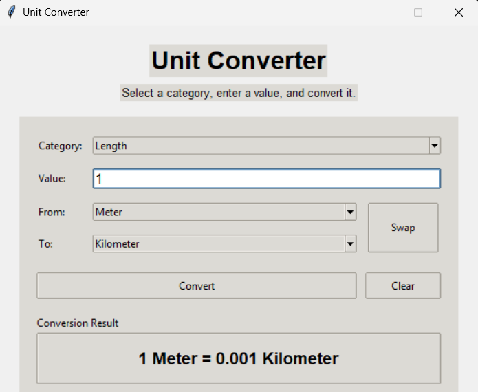

# # Unit Converter

**Unit Converter** is a modern desktop application built using **Python** and **Tkinter**.

> **Note :** It provides fast and accurate unit conversion for multiple measurement categories with a clean, simple, and user-friendly graphical interface.

---

## # Screenshot

  

---

## # Features

- Convert multiple measurement units
- Supports Length, Weight, Area, and Temperature
- Instant conversion results
- Clean and minimal Tkinter interface
- Swap units with a single click
- Automatic input validation
- Fully offline application
- Fast and lightweight

---

## # Tech Stack

- **Language:** Python
- **GUI Framework:** Tkinter
- **Data Processing:** Python Standard Library
- **Utilities:** Math Operations

---

## # Supported Conversions

### 📏 Length
- Meter
- Kilometer
- Centimeter
- Millimeter
- Mile
- Foot
- Inch

### ⚖️ Weight
- Kilogram
- Gram
- Pound
- Ounce

### 🌡️ Temperature
- Celsius
- Fahrenheit
- Kelvin

### 📐 Area
- Square Meter
